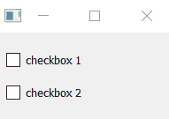

RQCheckbox
====================================

.. automodule:: pyreaqtive.widgets.rqcheckbox
   :members:
   :undoc-members:
   :show-inheritance:
   :special-members:
   :private-members:
   :exclude-members: __annotations__, __module__

.. literalinclude:: ../../../examples/rqbool_rqcheckbox.py
   :caption: RQCheckbox with RQBool Example

